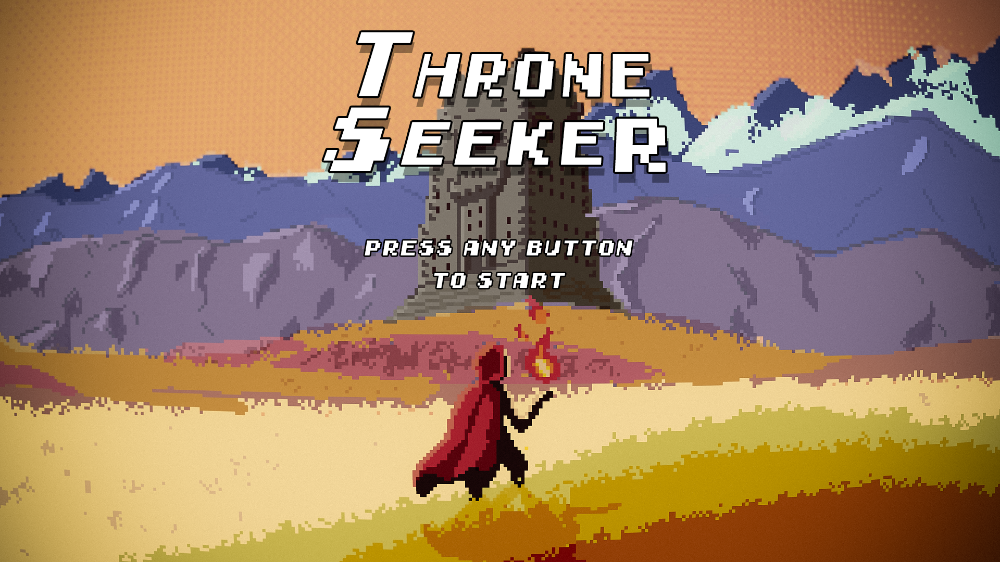
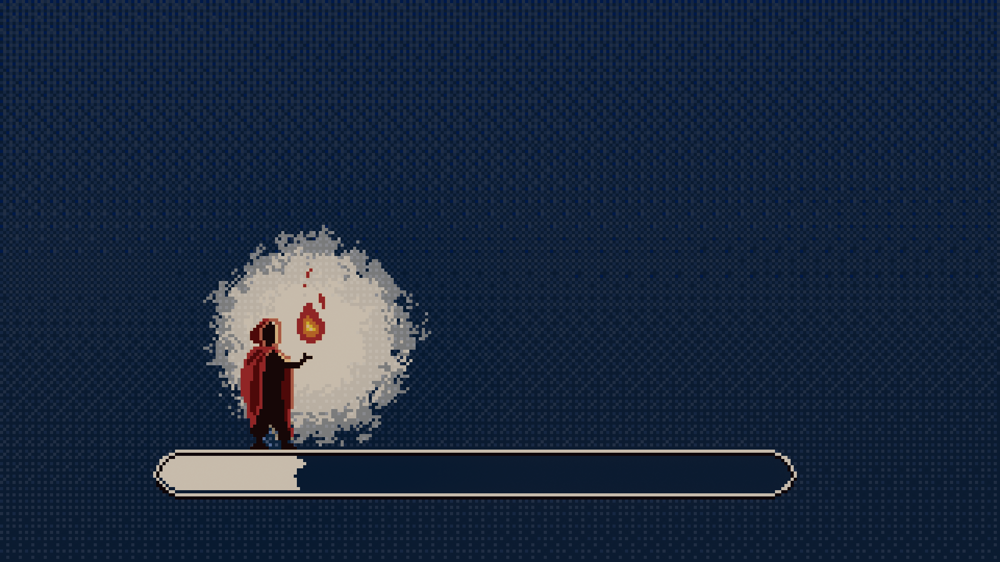

  

# Throne Seeker

*Reclaim the throne, restore the kingdom's peace.*

  

### Built with the tools and technologies:

  
 
  <a href="https://github.com/simaocampanicodev/ThroneSeeker"><strong>Explore the docs »</strong></a>

## About The Project

 

**Throne Seeker** is a story-rich indie adventure where you step into the boots of a mysterious wizard draped in a flowing, arcane cape—on a quest not just for a throne, but for truth.
 
The kingdom lies fractured. A once-benevolent king now rules with corruption and fear, his castle locked behind enchanted gates. To unlock the path to the throne room and free the village from his grasp, you must journey far beyond its borders.

Explore a beautifully diverse world filled with enchanted biomes—from haunted swamps to frozen peaks and ancient ruins. Scattered across these lands stand elemental towers, each guarded by powerful mini-bosses who test your strength, evolve your abilities, and shape your destiny. Only by mastering these trials can you hope to confront what lies at the heart of the kingdom.

Loot mysterious chests, collect gold, and upgrade your magics and gears and purchase powerful relics.
 
**Your choices. Your journey. Your throne to reclaim.**

 

(<a href="#readme-top">back to top</a>)

## Getting Started

Here's the list of controls of the game:

WASD - Character movement

(<a href="#readme-top">back to top</a>)

## Contributors

Here's the list of the contributors of our game, we highly appreciate everyone reading this and we tried our best to make a good game, every feedback is **greatly appreciated**.
If you have a suggestion that would make this better, please contact us.

Don't forget to give the project a star! Thanks again!
 

. Developer: Simão Campaniço - [simaocampanicodev](https://github.com/simaocampanicodev)

. Artist: Rafael Martins - [RafaelSMartins](https://github.com/RafaelSMartins)

(<a href="#readme-top">back to top</a>)

## Contact

Github: <a href="https://github.com/simaocampanicodev/ThroneSeeker"><strong>https://github.com/simaocampanicodev/ThroneSeeker</strong></a>

 
Itch.io: <a href="https://rafaelsmartins.itch.io/throne-seeker"><strong>https://rafaelsmartins.itch.io/throne-seeker</strong></a>

(<a href="#readme-top">back to top</a>)

